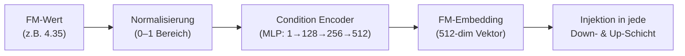
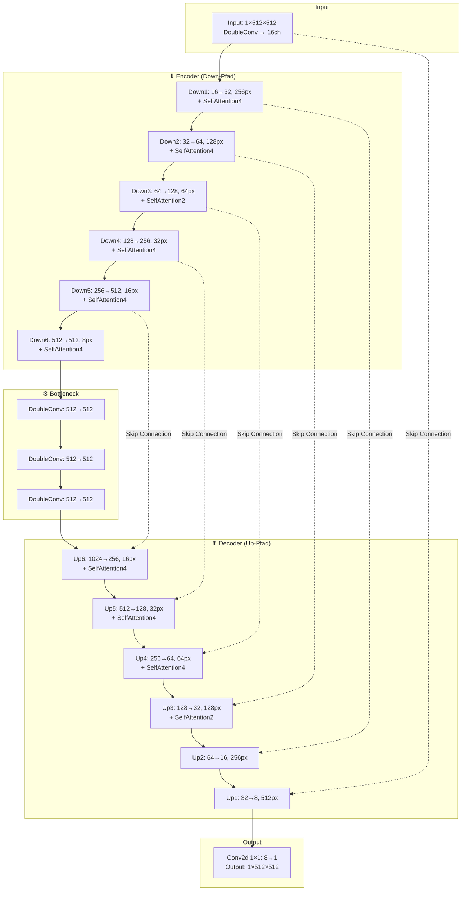

# Zusammenfassung: Konditioniertes DDPM für Mikrostruktur-Bildgenerierung

## 1. Anwendung

Das Modell generiert **Graustufenbilder (512×512 px)** von Mikrostrukturen einer **guss-geschmiedeten AZ80-Magnesiumlegierung**. Die Bilder werden konditioniert auf einen **Feed-Modulation (FM)** Prozessparameter erzeugt, sodass das Modell für beliebige FM-Werte innerhalb des trainierten Bereichs realistische Mikrostrukturbilder synthetisieren kann.

---

## 2. Modelltyp: Ja – Denoising Diffusion Probabilistic Model (DDPM) mit Conditioning

> [!IMPORTANT]
> Es handelt sich **definitiv um ein DDPM mit Conditioning**. Das Modell folgt dem klassischen DDPM-Framework nach [Ho et al., 2020](https://arxiv.org/abs/2006.11239) und wurde um eine **kontinuierliche Konditionierung** erweitert.

### Belege im Code

| Eigenschaft | Implementierung | Datei |
|---|---|---|
| **Linearer Noise-Schedule** | `torch.linspace(β_start, β_end, T)` | [ddpm_mp.py](file:///c:/Users/larsr/OneDrive%20-%20Students%20RWTH%20Aachen%20University/Uni/Masterarbeit/BA/DDPM_Grayscale_512x512/ddpm_mp.py#L80-L81) |
| **Forward Process** (q-Verteilung) | `x_t = √ᾱ_t · x_0 + √(1−ᾱ_t) · ε` | [ddpm_mp.py](file:///c:/Users/larsr/OneDrive%20-%20Students%20RWTH%20Aachen%20University/Uni/Masterarbeit/BA/DDPM_Grayscale_512x512/ddpm_mp.py#L83-L87) |
| **Reverse Process** (Sampling) | Standard DDPM Reverse-Schrittformel | [ddpm_mp.py](file:///c:/Users/larsr/OneDrive%20-%20Students%20RWTH%20Aachen%20University/Uni/Masterarbeit/BA/DDPM_Grayscale_512x512/ddpm_mp.py#L92-L113) |
| **MSE-Loss** auf vorhergesagtes Rauschen | `mse(noise, predicted_noise)` | [ddpm_mp.py](file:///c:/Users/larsr/OneDrive%20-%20Students%20RWTH%20Aachen%20University/Uni/Masterarbeit/BA/DDPM_Grayscale_512x512/ddpm_mp.py#L175) |
| **Conditioning mit FM** | FM-Wert wird in jede Up/Down-Schicht injiziert | [modules.py](file:///c:/Users/larsr/OneDrive%20-%20Students%20RWTH%20Aachen%20University/Uni/Masterarbeit/BA/DDPM_Grayscale_512x512/modules.py#L444) |

---

## 3. Conditioning: Ja – der FM-Wert (Feed Modulation)

> [!IMPORTANT]
> Die Konditionierung basiert auf **einem einzigen kontinuierlichen FM-Wert** (Feed-Modulation-Prozessparameter).

### Wie funktioniert das Conditioning?



**Normalisierung** ([configuration.py:69-70](file:///c:/Users/larsr/OneDrive%20-%20Students%20RWTH%20Aachen%20University/Uni/Masterarbeit/BA/DDPM_Grayscale_512x512/configuration.py#L69-L70)):
```python
def normalize_fm(fm_value):
    return (fm_value - 2.244) / (8.565 - 2.244)  # Min-Max auf [0,1]
```

**Condition Encoder** ([modules.py:424-430](file:///c:/Users/larsr/OneDrive%20-%20Students%20RWTH%20Aachen%20University/Uni/Masterarbeit/BA/DDPM_Grayscale_512x512/modules.py#L424-L430)):
```python
self.condition_encoder = nn.Sequential(
    nn.Linear(1, 128),   nn.SiLU(),
    nn.Linear(128, 256),  nn.SiLU(),
    nn.Linear(256, 512)   # → gleiche Dimension wie Time-Embedding
)
```

**Injektion**: In jeder `Down`- und `Up`-Schicht wird das FM-Embedding über ein weiteres MLP in ein Feature-Map der entsprechenden räumlichen Größe transformiert und per **Kanalkonkatenation** an die Feature-Maps angehängt.

> [!NOTE]
> Es existierte ursprünglich eine **diskrete Konfiguration** mit 18 FM-Klassen (auskommentiert in [configuration.py:36-51](file:///c:/Users/larsr/OneDrive%20-%20Students%20RWTH%20Aachen%20University/Uni/Masterarbeit/BA/DDPM_Grayscale_512x512/configuration.py#L36-L51)). Die aktuelle Version nutzt **kontinuierliche** FM-Werte, was auch Interpolationen zwischen trainierten Werten ermöglicht (z.B. FM=5.2 oder FM=6.5 wurden getestet).

### Verfügbare FM-Trainingswerte

| Index | FM-Wert | Index | FM-Wert | Index | FM-Wert |
|-------|---------|-------|---------|-------|---------|
| 0 | 2.244 | 6 | 3.675 | 12 | 7.252 |
| 1 | 2.782 | 7 | 4.350 | 13 | 7.481 |
| 2 | 2.879 | 8 | 4.045 | 14 | 8.288 |
| 3 | 3.055 | 9 | 4.109 | 15 | 8.331 |
| 4 | 3.156 | 10 | 4.546 | 16 | 8.556 |
| 5 | 3.464 | 11 | 4.644 | 17 | 8.565 |

---

## 4. Architektur: Ja – UNet mit Down, Up, Bottleneck, Skip Connections & Self-Attention

> [!IMPORTANT]
> Das Modell ist ein **UNet_conditional** bestehend aus **6 Down-Blöcken**, **3 Bottleneck-Blöcken** und **6 Up-Blöcken**, verbunden durch **Skip Connections** und **Self-Attention-Layer**.

### Architekturdiagramm



### Detaillierte Komponenten

#### Down-Block (Encoder)
Jeder `Down`-Block besteht aus:
1. **MaxPool2d(2)** – Halbiert die räumliche Auflösung
2. **DoubleConv (residual)** – Zwei 3×3-Faltungen mit GroupNorm + GELU + Skip-Verbindung
3. **DoubleConv** – Reduziert die Kanäle um `num_conditions` (=1) für die FM-Konkatenation
4. **Time-Embedding** – Sinusoidales Positionsencoding → SiLU → Linear → addiert zu Features
5. **FM-Embedding** – MLP → umgeformt in Feature-Map → per Kanalkonkatenation angefügt

#### Up-Block (Decoder)
Jeder `Up`-Block besteht aus:
1. **Upsample(2, bilinear)** – Verdoppelt die räumliche Auflösung
2. **Skip Connection** – Konkatenation mit dem entsprechenden Down-Block-Output
3. **DoubleConv (residual + normal)** – Verarbeitung der konkatenierten Features
4. **FM-Embedding** – MLP (512→64→128→imsize²) → Feature-Map → Konkatenation
5. **Time-Embedding** – Addiert wie im Down-Block

#### Bottleneck
3× hintereinander geschaltete **DoubleConv-Blöcke** (512→512→512→512), ohne Self-Attention.

#### Self-Attention
- **SelfAttention2** (2 Heads): Verwendet bei 64px und 128px Auflösung
- **SelfAttention4** (4 Heads): Verwendet bei allen anderen Auflösungen (256, 128, 32, 16, 8 px)
- Jeder Attention-Block enthält: LayerNorm → MultiheadAttention → Residual → FFN (GELU) → Residual

> [!NOTE]
> Einige Self-Attention-Layer im Up-Pfad sind **auskommentiert** (`as2`, `as1`), vermutlich aus Speichergründen bei der 512px-Auflösung.

---

## 5. Trainingsparameter

| Parameter | Wert | Beschreibung |
|---|---|---|
| **Bildgröße** | 512×512 px, Graustufe (1 Kanal) | Eingabe- und Ausgabegröße |
| **Batch Size** | 16 | Bilder pro Batch |
| **Gradient Accumulation** | 4 Schritte | Effektive Batch Size = 64 |
| **Epochen** | 400 | Gesamtzahl der Trainingsepochen |
| **Learning Rate** | 2×10⁻⁴ | Adam-Optimizer |
| **Noise Steps (T)** | 1000 | Anzahl der Diffusionsschritte |
| **β Schedule** | linear, β_start=1e-4, β_end=0.02 | Rausch-Schedule |
| **Time-Embedding Dim** | 512 | Sinusoidales Positionsencoding |
| **EMA Decay** | 0.995 | Für das Exponential Moving Average Modell |
| **EMA Start Step** | 2000 | EMA beginnt erst nach 2000 Schritten |
| **Loss-Funktion** | MSE (Mean Squared Error) | Zwischen wahrem und vorhergesagtem Rauschen |
| **Normalisierung** | `(t * 2) - 1` → Wertebereich [-1, 1] | Pixelwerte bei Eingabe |
| **Augmentation** | RandomCrop(512), ~~Flip~~ (auskommentiert) | Data Augmentation |
| **Multi-GPU** | DataParallel (wenn verfügbar) | Verteiltes Training |

---

## 6. Sampling / Bildgenerierung

Das Projekt bietet **drei Sampling-Methoden**:

| Methode | Schritte | Beschreibung |
|---|---|---|
| **DDPM Standard** | 1000 | Vollständiger Reverse-Prozess |
| **DDPM mit Zwischenspeicherung** | 1000 | Speichert Bilder alle N Schritte |
| **DDIM** | 50–200 (konfigurierbar) | Beschleunigtes, deterministisches Sampling |

Alle Methoden unterstützen **Classifier-Free Guidance (CFG)**, wobei im aktuellen Setup `cfg_scale=0` verwendet wird (kein Guidance).

### Sampling-Formel (DDPM)
```
x_{t-1} = (1/√α_t) · (x_t − (1−α_t)/√(1−ᾱ_t) · ε_θ(x_t, t, fm)) + √β_t · z
```

---

## 7. Kanalzählung im UNet

Ein besonderes Design-Detail: Die Kanalanzahl in den Down- und Up-Blöcken wird um `num_conditions = 1` reduziert, bevor das FM-Embedding per Konkatenation hinzugefügt wird. Dadurch bleibt die Gesamtkanalzahl nach der Konkatenation konsistent.

```python
# In Down:
DoubleConv(in_channels, (out_channels - num_conditions))  # → 1 Kanal weniger
x = torch.cat((x, fmemb), dim=1)  # → fmemb hat 1 Kanal → Gesamt = out_channels

# In Up:
DoubleConv(in_channels, out_channels - num_conditions, in_channels // 2)
x = torch.cat((x, fmemb), dim=1)
```

---

## Zusammenfassung der Antworten auf deine Fragen

| Frage | Antwort |
|---|---|
| Ist es ein DDPM? | ✅ **Ja** – klassisches DDPM mit linearem β-Schedule und 1000 Schritten |
| Funktioniert es mit Conditioning? | ✅ **Ja** – kontinuierliche Konditionierung, injiziert in jede UNet-Schicht |
| Ist das Conditioning ein FM-Wert? | ✅ **Ja** – ein einzelner Feed-Modulation-Wert (2.244–8.565), min-max-normalisiert |
| Besteht es aus Up, Down, Bottleneck? | ✅ **Ja** – 6 Down + 3 Bottleneck + 6 Up Blöcke |
| Skip Connections? | ✅ **Ja** – Konkatenation der Down-Outputs mit den Up-Inputs |
| Self-Attention? | ✅ **Ja** – SelfAttention2 (2 Heads) und SelfAttention4 (4 Heads) an verschiedenen Auflösungen |
