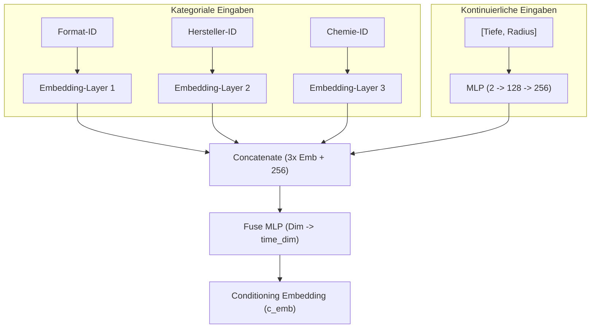
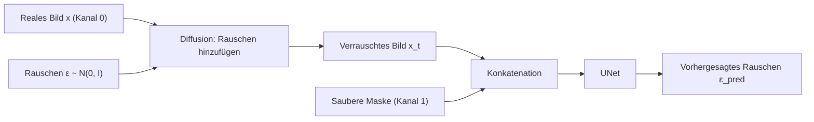

# Detaillierter Ablauf des DDPM-Trainings für Batterie-CT-Scans

Dieses Dokument beschreibt detailliert den Ablauf vor und während des Trainings des konditionierten Denoising Diffusion Probabilistic Models (DDPM) zur Generierung synthetischer CT-Scans von Batteriezellen. 

---

## 1. Vorbereitung der Daten (Pre-Training Phase)

Bevor das eigentliche Training gestartet werden kann, werden die Rohdaten analysiert, geometrisch vermessen und partitioniert. Dies geschieht über Hilfsskripte in den Ordnern `scripts` und erzeugt drei zentrale JSON-Dateien im Verzeichnis `CT_scan_model/`:

```
┌────────────────────────┐     ┌────────────────────────┐     ┌────────────────────────┐
│    cell_index.json     │     │   cell_geometry.json   │     │      splits.json       │
├────────────────────────┤     ├────────────────────────┤     ├────────────────────────┤
│ Mappt Zellen-IDs auf   │     │ Berechnet Mittelpunkt  │     │ Partitioniert Zellen   │
│ alle Schichtbilder     │     │ (cx, cy) und Radius r  │     │ strikt in Train, Val,  │
│ inkl. relativer Tiefe. │     │ der Zelle pro Scan.    │     │ und Test.              │
└────────────────────────┘     └────────────────────────┘     └────────────────────────┘
```

### Die Rolle der einzelnen Dateien:

1. **`cell_index.json` (Indexierung):**
   * Scannt das Datenverzeichnis und listet für jede Zelle (z. B. `EVE_18650_Lithium-ion_01`) alle verfügbaren Schichtbilder (Slices) auf.
   * Berechnet für jeden Slice die **relative Tiefe** (`rel_depth` im Bereich $[0.0, 1.0]$), wobei $0.0$ der obere Rand und $1.0$ der untere Rand der Batterie ist.

2. **`cell_geometry.json` (Geometrie):**
   * Bestimmt den physischen Mittelpunkt $(cx, cy)$ und den nutzbaren Außenradius $r_{valid}$ der Batteriezelle im Bild.
   * Speichert Metadaten wie das Zellformat, den Hersteller und die Chemie.

3. **`splits.json` (Daten-Splitting auf Zellebene):**
   * **Wichtig für die wissenschaftliche Validierung:** Die Aufteilung in Trainings-, Validierungs- und Testdaten erfolgt **strikt auf Zellebene**, nicht auf Slice-Ebene.
   * *Begründung:* Benachbarte Slices derselben physischen Batteriezelle weisen extrem hohe Ähnlichkeiten auf. Würde man Slices derselben Zelle auf Training und Validierung aufteilen, käme es zu massivem **Data Leakage** (Datenleckage). Das Modell würde die Feinstrukturen der Validierungszellen einfach aus dem Gedächtnis rekonstruieren. Durch das Splitten nach ganzen Zellen muss das Modell lernen, auf völlig unbekannten Batterien zu generalisieren.

---

## 2. Übergabe der Daten an das Modell

Während des Trainings lädt der PyTorch-DataLoader Batches über die Dataset-Klassen (z. B. [BatteryCTPerCellDataset](file:///c:/Users/larsr/Documents/Uni/Masterarbeit/Masterarbeit_cartesianApproach/CT_scan_model/dataset_ct_cartesian.py#L242)). Ein Batch besteht aus:

1. **Bild- und Maskentensor (`x`):** Ein Tensor der Form `[BatchSize, 2, Height, Width]`.
   * **Kanal 0 (Bild):** Das Graustufenbild der Batterie, normalisiert auf den Wertebereich $[-1.0, 1.0]$.
   * **Kanal 1 (Maske):** Die binäre Maske (1 im Inneren der Zelle, 0 im Padding-Bereich).
2. **Konditionierungs-Tupel (`cond`):** Bestehend aus zwei Tensoren:
   * `cat` (Kategorial): Tensor der Form `[BatchSize, 3]` mit den IDs für (Zellformat, Hersteller, Chemie).
   * `cont` (Kontinuierlich): Tensor der Form `[BatchSize, 2]` mit den Werten für (relative Tiefe, relativer Radius).
3. **Verlustmaske (`mask`):** Ein Tensor der Form `[BatchSize, Height, Width]`, der zur Berechnung des Masked-Loss herangezogen wird.

---

## 3. Verarbeitung der Bedingungen (Conditioning) im Modell

Die Konditionierung steuert, welche Art von Batteriebild das Modell erzeugen soll. Es gibt **5 Bedingungen**:

| Parameter | Typ | Beschreibung | Wertebereich |
| :--- | :--- | :--- | :--- |
| **Zellformat** | Kategorial | Bauform der Batterie | z. B. `18650`, `2170`, `4680` |
| **Hersteller** | Kategorial | Produzent der Zelle | z. B. `EVE`, `Samsung`, `LG` |
| **Chemie** | Kategorial | Chemische Zusammensetzung | z. B. `Lithium-ion`, `LFP` |
| **Relative Tiefe** | Kontinuierlich | Vertikale Position der Schicht | $[0.0, 1.0]$ |
| **Relativer Radius** | Kontinuierlich | Physische Größe der Zelle im Bild | $(0.0, 1.0]$ |

### Technische Einbettung (ConditionEncoder)

Der [ConditionEncoder](file:///c:/Users/larsr/Documents/Uni/Masterarbeit/Masterarbeit_cartesianApproach/CT_scan_model/modules_cartesian_ct.py#L94) fusioniert diese 5 Eingaben in ein einziges Conditioning-Embedding:



### Injektion in das UNet
Das berechnete Embedding `c_emb` (Größe `time_dim`, z. B. 256 oder 512) wird in jedem einzelnen **Down- und Up-Block** des UNet injiziert:
1. Ein MLP projiziert `c_emb` auf `cond_channels = 1`.
2. Dieser 1-dimensionale Wert wird räumlich auf die Größe der aktuellen Feature-Map des Blocks dupliziert (z. B. `[B, 1, H_layer, W_layer]`).
3. Die resultierende Konditionierungs-Map wird per **Kanalkonkatenation** an die Feature-Maps angehängt.
4. Gleichzeitig wird das zeitliche Rauscheinbettung-Projektionssignal (`t_map`) addiert.

### Classifier-Free Guidance (CFG) Training
Um Classifier-Free Guidance beim Sampling zu ermöglichen, wird die Konditionierung während des Trainings mit einer Wahrscheinlichkeit von z. B. $10\%$ (`--p-uncond 0.1`) verworfen. In diesem Fall wird `cond = None` übergeben, und der `ConditionEncoder` gibt stattdessen einen gelernten, konstanten Dummy-Parameter (`self.uncond`) zurück.

---

## 4. Bildübergabe, Verrauschung und Maskierung

Der Diffusionsprozess läuft mathematisch wie folgt ab:



### Der Verrauschungsprozess (Forward Process)
Das Modell lernt, Rauschen vorherzusagen. In jedem Trainingsschritt wird für jedes Bild ein zufälliger Zeitschritt $t \in [1, 1000]$ gewählt.
* Das Rauschen wird **nur auf den Bildkanal** addiert ([diffusion_cartesian.py](file:///c:/Users/larsr/Documents/Uni/Masterarbeit/Masterarbeit_cartesianApproach/CT_scan_model/diffusion_cartesian.py#L34-L52)):
  $$x_{t, \text{img}} = \sqrt{\bar{\alpha}_t} \cdot x_{0, \text{img}} + \sqrt{1 - \bar{\alpha}_t} \cdot \epsilon$$
  wobei $\epsilon \sim \mathcal{N}(0, \mathbf{I})$ das normalverteilte Rauschen ist.
* Der Maskenkanal wird **nicht** verrauscht. Das UNet erhält als Eingabe den kombinierten Tensor `[x_{t, img}, mask]`. Dadurch "weiß" das Modell zu jedem Zeitpunkt, wo sich die Batterie befindet und wo das Padding liegt.

### Die Rolle der Maske und des Paddings im Training
* **Padding:** Pixel außerhalb der Zelle (wo die Maske $0$ ist) enthalten keine physikalische Information. In den kartesischen Graustufenbildern werden diese Pixel auf $0.0$ gesetzt.
* **Das Problem:** Wenn das Modell das Rauschen über das gesamte Bild (inklusive des leeren Padding-Bereichs) vorhersagen müsste, würde es wertvolle Netzwerkkapazität darauf verschwenden, das Rauschen im leeren Raum zu rekonstruieren.
* **Die Lösung (Masked MSE Loss):**
  Die Verlustfunktion berechnet den Fehler (Mean Squared Error) zwischen dem echten Rauschen $\epsilon$ und dem vorhergesagten Rauschen $\epsilon_{\text{pred}}$ **ausschließlich innerhalb des maskierten Bereichs**:
  $$\mathcal{L}_{\text{masked}} = \frac{\sum \left( (\epsilon - \epsilon_{\text{pred}})^2 \odot \text{mask} \right)}{\sum \text{mask}}$$
  *(wobei $\odot$ die elementweise Multiplikation darstellt)*

### Einfluss auf die Backpropagation
Durch den Masked Loss hat der Padding-Bereich direkten Einfluss auf den Gradientenfluss:
1. Da Pixel außerhalb der Maske mit $0$ multipliziert werden, tragen sie nicht zum Loss-Wert bei.
2. Bei der Berechnung der partiellen Ableitungen (Backpropagation) sind die Gradienten bezüglich aller Gewichte, die ausschließlich Padding-Bereiche verarbeiten, mathematisch exakt **Null**.
3. Das Netzwerk aktualisiert seine Gewichte somit nur basierend auf den Fehlern im Inneren der Batterie. Es lernt, die Rauschvorhersage im leeren Außenbereich komplett zu ignorieren.

---

## 5. Bedeutung des Wertebereichs [-1, 1]

Die Skalierung der Eingabebilder auf den Bereich $[-1, 1]$ (statt $[0, 255]$ oder $[0, 1]$) ist ein Standardverfahren bei Diffusionsmodellen und hat fundamentale mathematische und numerische Gründe:

1. **Symmetrie zum Gaußschen Rauschen ($\mathcal{N}(0, \mathbf{I})$):**
   * Das hinzugefügte Rauschen $\epsilon$ hat einen Mittelwert von $0.0$ und eine Varianz von $1.0$.
   * Ein auf $[-1, 1]$ normalisiertes Bild hat ebenfalls einen Mittelwert nahe $0.0$.
   * Würde man Bilder im Bereich $[0, 255]$ nutzen, gäbe es bei großen Zeitschritten $t$ (nahe $T=1000$, wo das Bild fast nur noch aus Rauschen besteht) einen massiven **Mittelwert-Shift** (Mean Shift) in Richtung Null. Das Modell müsste mühsam lernen, diesen Shift auszugleichen. Die Skalierung $[-1, 1]$ eliminiert diesen Shift.

2. **Numerische Stabilität bei Aktivierungsfunktionen:**
   * Neuronale Netze verwenden Aktivierungsfunktionen wie GELU oder SiLU. Diese Funktionen besitzen ihre maximale Nichtlinearität und den stabilsten Gradientenfluss nahe dem Koordinatenursprung ($0.0$).
   * Sehr große Eingabewerte (wie $255.0$) treiben die Neuronen in die Sättigungsbereiche der Aktivierungsfunktionen, was zu sterbenden Gradienten ("vanishing gradients") und instabilem Training führt.

3. **Verhinderung von Overflow/Underflow bei Mixed Precision:**
   * Das Training läuft oft mit Mixed Precision (FP16/AMP). Der Wertebereich FP16 hat einen stark eingeschränkten Dynamikbereich.
   * Werte nahe $[-1, 1]$ verhindern numerische Instabilitäten (Überläufe oder Unterläufe) in den tiefen Schichten des UNet-Modells.
